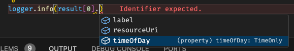

# Data monitoring count report generation service

This is a microservice emulating the functionality of a future microservice to be built. It will be called `dm-report-generation-service`. This service is to be embedded in [Data monitoring](https://github.com/lblod/app-data-monitoring) which is under development.

The point of this microservice is to contain functionality that contacts a specific SPARQL endpoint using SPARQL queries. A function needs to run automatically every night which executes queries to gather information about specific resources. In this particular case the microservice will just count the amount of new records each day for each governing body (bestuursorgaan) of each admin unit (bestuurseenheid). Reports are written to a different SPARQL endpoint. This will not make any sense to you unless you are aware of the specific context within which ABB (Agentschap Binnenlands Bestuur) operates; which is the agency of the Flemish government this service was designed for.

So every night this service will run a procedure which targets the linked data published the day before. This nightly procedure looks as follows in pseudocode (for now).

```plaintext
FOR EACH endpoint IN endpoints:
  FOR EACH adminUnit IN adminUnits:
    FOR EACH governingbody IN adminUnit.governingBodies:
      FOR EACH resouceClass IN endpoint.resouces:
        Count new resources of the last day
      Write governing body report
    Write admin unit report
Write aggegated reports (overviews)
```

It will be updated in the future.

## Stack

* Node LTS/Iron (v20.12.2)
* Typescript v5.4
* Compile to ESNEXT (ES2022 or better at time of publishing)
  * Top level await and other fun stuff
* ECMAScript modules; not CommonJS
* [Comunica](https://comunica.dev/) for SPARQL stuff
* [Dayjs](https://day.js.org/) for date and time stuff
* [Handlebars](https://handlebarsjs.com/guide/) for templating of queries
* [Zod](https://zod.dev/) for schema validation of any user provided input such as configuration and query parameters
* [Winston](https://www.npmjs.com/package/winston) for logging. In this way we don't end up dumping everything in `console.log` and we have some control over the output.
* Good old [Express](https://expressjs.com/)

## Configuration

### Environment variables

| Variable name & type | Default value | Explanation |
| :--- | :--- | :--- |
| ADMIN_UNIT_ENDPOINT<br>(string, URL) | No default. Required. | URL of the SPARQL endpoint where the reporting service can query for admin units and governing bodies. Typically ending in `/sparql` |
| REPORT_ENDPOINT<br>(string, URL) | No default. Required | Url of the SPARQL endpoint where the reporting service can write reports to  |
| DISABLE_DEBUG_ENDPOINT<br>(boolean) | `"true"` | True activates endpoints which can be used for testing. See discussion below. In production these endpoint should be disabled. |
| REPORT_GRAPH_URI<br>(string, URI) | `"http://mu.semte.ch/graphs/public"` | The URI of the graph where to write report related linked data to. |
| CONFIG_FILE_LOCATION<br>(string, directory) | `"/config"` | The directory where the config file can be found. Useful for development. Default value is the location in the container. |
| SLEEP_BETWEEN_QUERIES_MS<br>(integer) | `0` | Value in milliseconds. Setting this higher than 0 means the service will wait the specified number of milliseconds after each query before the next query. This may be needed in order to prevent the service from overloading the database. |
| SHOW_SPARQL_QUERIES<br>(boolean) | `"false"` | Set to true to print the queries to the console (`info` log level) |
| LIMIT_NUMBER_ADMIN_UNITS<br>(integer) | `0` | 0 Means query for all admin units. A non zero value imposes a limit. This is useful for testing so you don't flood the database. I'd suggest you set it to 5 for testing. |
| ORG_RESOURCES_TTL_S<br>(number) | `300` | Value in seconds. Data concerning admin units and governing bodies are kept in a cache with a Time To Live (TTL). This prevents unnecessary load during repeated test invocations of report generation. After this time has elapsed the cache is cleared and new data needs to be queried.
| SERVER_PORT<br>(number) | `80` | HTTP port the server listens on. For debugging locally I suggest port 4199. |
| REPORT_CRON_EXPRESSION<br>(string, cron expression) | `"0 0 * * *"` | The cron expression which invokes the report generation script. Default is every day at 00:00. |
| LOG_LEVEL<br>(string) | `"info"` | Level of the logs. Accepted values are "error","warn","info","http","verbose","debug" and "silly". For production set to "error". For development set to "info" or "debug". |
| NO_TIME_FILTER<br>(boolean) | `"false"` | Set to true for testing. This disabled the date related filtering when counting. This can be useful when no new data was posted and too many queries yield 0. |
| DUMP_FILES_LOCATION<br>(string, directory) | `"/dump"` | Only relevant if DISABLE_DEBUG_ENDPOINT is `false`. This specifies the directory where the service will save the dump files for debugging. |

* Boolean: "true" for `true`, "false" for `false`.

The program will validate the environment variables before running. If you made a mistake the program will stop until you fix the error. An error could be providing a string where a number is expected or a faulty value for a boolean.

### File

When using this service you'll need to make a volume that links a directory to the `/config` directory in the container. This directory should contain a `config.json` file. The contents should look like this:

```JSON
{
  "$schema": "https://raw.githubusercontent.com/lblod/dm-count-report-generation-service/master/config-schema.json",
  "endpoints": [
    {
      "url":"...",
      "classes": [
        "besluit:Besluit",
        "besluit:Agendapunt",
        ...
      ]
    }
  ],
  ...
}
```

It's a list of endpoints specifying a SPARQL endpoint URL and a list of resources to count. There is a JSON schema so you should not make any mistaktes. If you do mess up the schema though the program will crash on startup and you'll get a slap on the wrist. Both short notations of URI's and full ones are supported.

## Testing

### Running locally

You'll need node v20.12.2 or higher. I suggest using [NVM](https://github.com/nvm-sh/nvm). If you do use NVM you can run:

1. `nvm install lts/iron`
2. `nvm use lts/iron`

To run locally:

1. Clone the repo
2. Run `npm install` in the folder
3. Change the file `env-dev` to your preferences.
4. Run `npm run dev` and nodemon will start. It will run the service using [tsx](https://github.com/privatenumber/tsx).

VSCode users can use the debugger. Again make sure `env-dev` is adapted to your circumstance and press play in the debugger sidebar.

### Running from a container

Adapt the environment variables in the `run` file. Then run it `./run`.

It will build the image and then spin up a container. There will be strict type checking during building.

## Debugging

When running the node process locally or when running the container you can trigger the report generation process manually for testing purposes.

For this example we'll assume the server is running on your local machine using port 4199.

To trigger report generation use the browser to request ...

* `http://localhost:4199/generate-reports-now` to generate reports for 'yesterday'
* `http://localhost:4199/generate-reports-now?day=2024-05-01` to generate reports for a specific day.

When passing a day in the query parameters use the format `YYYY-MM-DD` (ISO).

This process can take a long time. You will not be seeing updates so it's best you look at the logs. When the report generation process finishes or errors out the browser will show a simple HTML page with the results.

To check the current configuration use the browser to request:

* `http://localhost:4199/configuration`

When `DISABLE_DEBUG_ENDPOINT` is set to `false` all of the triples created with INSERT queries will be stored in memory. You can create a TTL dump file by sending a GET request to `/dump-file`. To create a dump called `my-dump.ttl` use the url below. The query parameter is optional. If omitted it will use the current timestamp.

* `http://localhost:4199/dump?filename=my-dump`

To see an index of the dump files use:

* `http://localhost:4199/dump-files`

The get an index of all debug functions use:

* `http://localhost:4199/debug`

## Reports format

There are a number of types of reports:

1. Governing body (bestuursorgaan) type: Associated with a specific day and governing body
2. Admin unit (bestuurseenheid of organisatie) type: Associated with a specific day and admin unit. Linked to all associated governing body reports
3. Aggregated report (still to be developed)
4. Monthly report (still to be developed)
5. Aggregated report of several admin units together

TODO: Overview of reports and their schema.

## Developing this service further

### The templated query system

If you wish to change the queries and/or add query invocations you'll need to know how the templated query system works.

In order to write a new query add one in `report-generation/queries.ts` or another file.

Fist write a query using [handlebars](https://handlebarsjs.com/) like this:

```typescript
export const mySelectQueryTemplate = Handlebars.compile(`\
{{prefixes}}

SELECT ?resourceUri ?label WHERE {
  ?resourceUri a <{{classUri}}>;
    skos:prefLabel ?label;
    example:day {{toDateLiteral day}};
    example:time ?time.
}
`, { noEscape:true });
```

DON'T forget the 'noEscape: true' part. This is not HTML and we don't want HTML encoding.

It's important to add two typescript types together with a SELECT query and export them: one for the input and one for the output. For INSERT queries you will only need an input type.

The input is what will be passed to the handlebars templating system. In this case:

```typescript
export type MySelectQueryInput = {
  prefixes: string;
  classUri: string;
  day: DateOnly;
}
```

To ANY variable in the template needs a corresponding key in the type. Feel free to use types like 'DateOnly' of 'TimeOnly' or some enums. In this case you will need the literal helper which converts the type to an RDF literal (`"Serial"^^"xsd:Type"`).

| Variabele type | Helper | Type Notation | Handlebars notation |
| :--- | :--- | :--- | :--- |
| `DateOnly` | `toDateLiteral` | `exampleDate:DateOnly` | `{{toDateLiteral exampleDate}}` |
| `TimeOnly` | `toTimeLiteral` | `exampleTime:TimeOnly` | `{{toDateLiteral exampleTime}}` |
| `Dayjs` | `toDateTimeLiteral` | `exampleDateTime:DayJs` | `{{toDateTimeLiteral exampleDateTime}}` |
| `TaskStatus` | `toTaskStatusLiteral` | `exampleStatus:TaskStatus` | `{{toTaskStatusLiteral exampleStatus}}` |

The last row in the table in an enum value. Other enums such as `TaskType`, `JobStatus`, `JobType`, `DayOfWeek` and `DatamonitoringFunction` are also supported in a similar way.

The output is linked to the selected variables after the `SELECT` keyword. In this case.

```typescript
export type MySelectQueryOutput = {
  resourceUri: string;
  label: string;
  timeOfDay: TimeOnly;
}
```

In this type structure you can also use TimeOnly, DateOnly, Dayjs(modeling a timestamp) and enums. When parsing the bindings after querying the objects function will automatically convert the function to the correct type because the linked data has type information. Of course you can just use strings and number without helpers. Remember that Handlebars is 'dumb'. Whatever template you write will need to be correct SPARQL. So putting URI's in your query will require you not to forget the `<` and `>` characters.

Then, in another file where you want to execute the query, you'll instantiate the TemplatedSelect class.

```typescript
const mySelectQuery = new TemplatedSelect<
  MySelectQueryInput, // Input type parameter
  MySelectQueryOutput, // Output type parameter
>(
  queryEngine, // The comunica query engine. Get it from query-engine.ts module
  endpoint, // URL of endpoint; typically ending in '/sparql'
  mySelectQueryTemplate, // The handlebars template you exported earlier
);
```


Now this query machine is ready to go. You can launch it in two ways:

* `await mySelectQuery.bindings(input)`: Get results as an array of comunica bindings.
* `await mySelectQuery.objects('resourceUri', input)`: Get results as an array of javascript objects in the shape of `MySelectQueryOutput[]` in the example.

The objects function needs to map the bindings onto a list of objects modeling resources. In order to do that it needs a key that is the URI of the resource being returned. Now we can perform the query using the objects function and get results.

```typescript
// Perform the query and get the results as objects.
const result = await mySelectQuery.objects('resourceUri', {
  prefixes: PREFIXES,
  classUri: 'http://whatever.com/ns/examples/classes/Example',
  day: DateOnly.yesterday(),
});

// Print the results
for (const row of result) {
  logger.info(`Row. Resource <${row.resourceUri}> with label "${row.label}" and time of day ${timeOfDay.toString()}`);
}
```

`result` is an array of objects of the type `MySelectQueryOutput`.



This class works well up to tens of thousands of rows but was not really designed to handle really large amounts of rows. There is no optimization for extremely large result sets at this time. This is also not an ORM and it cannot handle relations and/or follow links. It's mostly created because this service will generate a LOT of different queries.

Just one little snippet to complete the example. Here's how you consume the results:

```typescript
// Perform the templated query using specific input parameters
const result = await mySelectQuery.objects({
  prefixes: PREFIXES,
  classUri: "http://data.vlaanderen.be/ns/besluit#Besluit",
});
```

Because of the way the templated query system was designed you should get full type checking at compile time. I hope it helps to prevent bugs.

If you have a query which returns only one row (many count queries) you can use the result function which does not try to map to a list of objects but just gives you one `MySelectQueryOutput` record. Be mindful that this function will throw if more then one row is returned. If you want to do your own thing just use the `bindings` function to get the result as Comunica bindings.

```typescript
// If you only want the first row do this:
const first = await mySelectQuery.result(input)
```
`INSERT` queries are similar to `SELECT` ones but give no output. They only have an input type and to invoke them you need to call the `execute` function.

For queries that ONLY insert data you should use the `TemplatedInsert` class. For queries that modify or update data you'll have to use the `TemplatedUpdate` class. The only difference between the two is that the `TemplatedInsert` class writes the triples to a memory store as well for debugging. `TemplatedUpdate` just executes queries that do whatever and return no output.

### Async wrappers

The util package contains some handy dandy wrapper functions that all work the same way. Because of the nature of this service there are to functionalities that are often needed:

* Retrying: You'll want some database queries to be able to be retried a couple of times because SPARQL endpoints can be be glitchy sometimes.
* Timing: You'll want to know how long some queries take (milliseconds) and how long some long running functions take (seconds)

These are the wrapper functions in the util package.

* `


